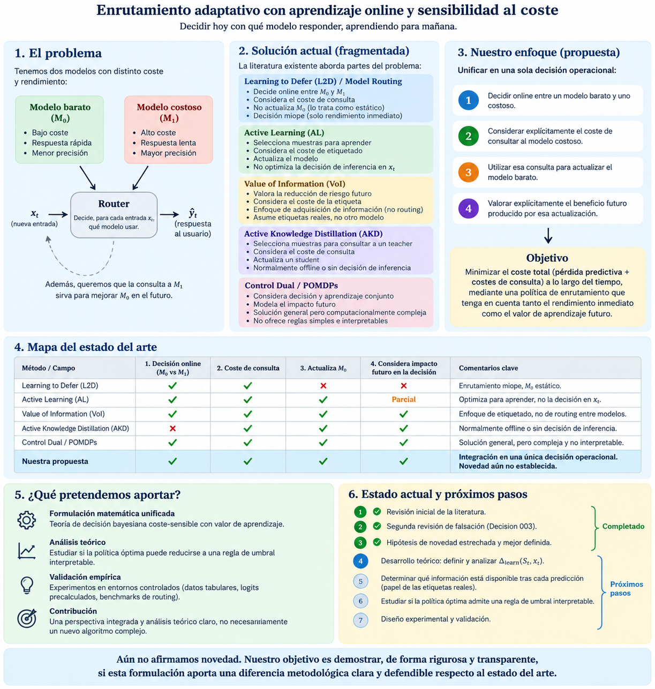

# Adaptive model routing

Proyecto de investigación sobre decisiones adaptativas y coste-sensibles entre modelos predictivos heterogéneos. Decision 010 cierra la teoría principal del modelo lineal-cuadrático para comenzar el diseño del primer ciclo experimental. No se ha establecido novedad ni se han ejecutado experimentos.

## Línea primaria: Adaptive Cost-Aware Routing with Learning Value

Se consideran inicialmente dos modelos predictivos heterogéneos: uno barato y adaptable y un teacher costoso y potencialmente falible. Consultar al modelo costoso puede aportar dos beneficios:

1. **Immediate predictive value**: mejorar la decisión correspondiente a la observación actual.
2. **Learning value**: proporcionar información para adaptar el modelo barato y mejorar su competencia futura.

La acción presente puede, por tanto, modificar la competencia futura del sistema barato. Conceptualmente, la decisión debe considerar:

```text
immediate predictive value + future learning value
versus
cost of using the expensive model
```

Decision 006 de `docs/research_log.md` cierra la auditoría dirigida de Sogawa (2013), Sekhari et al. (2023), Hanneke & Yang (2021) y Dekel et al. (2012), junto con los antecedentes ya revisados Gangrade (2021), TRACER y ThriftyDAgger. Valor futuro de aprendizaje, supervisión falible, consultas selectivas, compromiso errores/consultas, actualización online, expertos locales múltiples, coste de consulta y perjuicio empírico por información adicional ya tienen antecedentes. Selective sampling no debe describirse globalmente como myopic: puede buscar información deliberadamente para mejorar decisiones futuras.

La hipótesis candidata es la conjunción de:

1. Decisión de routing antes de la respuesta operacional final.
2. El predictor costoso D reemplaza la respuesta de F para la muestra actual.
3. Esa misma respuesta de D actualiza F.
4. La política valora la consecuencia predictiva inmediata.
5. La política valora explícitamente el cambio de valor de continuación causado por esa actualización particular.
6. D puede ser falible y el valor de adaptación puede ser negativo.

**No direct equivalent has yet been identified after targeted audit** satisfying all six properties jointly. Se trata de una región candidata, no de una novedad establecida. La búsqueda bibliográfica amplia queda pausada. Decision 007 fija el protocolo de feedback fiable retrasado y deriva el valor de una pseudoactualización lineal vectorial; Decision 009 extiende ese resultado al transporte bajo aprendizaje posterior común, con hipótesis explícitas. La continuación secuencial completa sigue abierta. El checkpoint bibliográfico y la matriz comparativa están en `docs/literature/primary_novelty_review.md`.

Esta hipótesis todavía no está establecida como novedosa y continúa sujeta a falsación. Decision 010 permite pasar al diseño experimental sin exigir resolver la continuación adaptativa completa; no convierte los resultados del modelo mínimo en una afirmación de novedad.

Decision 007 adopta routing antes de responder, sustitución operacional de F por D, pseudoactualización inmediata con la misma salida D(x_t) y llegada exógena de Y_t tras retardo fijo tau, independientemente del routing. Y_t puede corregir F después: consultar D compra supervisión anticipada imperfecta, no ground truth. Se comienza con hard labels; el modelo lineal de regresión usa respuestas escalares puntuales. Logits, confianza y feedback ocasional quedan como extensiones.

Se distinguen `Delta_now` (ganancia inmediata), `Delta_R` (cambio exacto del riesgo poblacional tras una pseudoactualización) y `Delta_adapt` (valor acumulado/secuencial). El modelo mínimo muestra compatibilidad isotrópica bajo updates conservadores y existencia de conflicto anisotrópico para pasos arbitrariamente pequeños. Decision 010 añade condiciones de persistencia temporal y posibilidad geométrica de inversión bajo `M=cI`, manteniendo el alcance del transporte común y sus limitaciones probabilísticas. El puente a evaluación es `Delta_now - C_D + gamma Delta_adapt^(H)`; no es una política óptima ni una regla práctica ya implementada.

**Core theory frozen for first experimental cycle.** Se admiten correcciones matemáticas y aclaraciones necesarias; nuevas extensiones teóricas esperan una necesidad concreta indicada por los experimentos. El horizonte aislado `B_H Delta_R` se conserva como caso especial, no como dinámica general.

### Current research overview

The following diagram records the interpretation after Decision 003 and predates
the consolidations in Decisions 005–007. It requires scientific review against
the targeted audit, ThriftyDAgger, and TRACER; use the current novelty review for the working hypothesis.



## Línea secundaria: Bayesian Cost-Aware Routing under Changing Operating Conditions

Esta línea estudia modelos inicialmente fijos y separa explícitamente:

1. La estimación de la competencia predictiva relativa entre modelos.
2. La toma de decisiones Bayesiana.

Se estimará la ganancia predictiva relativa y se estudiará cómo debe transformarse la regla óptima de routing ante cambios en el coste computacional, el coste de latencia, el coste del error, los priors de clase, la composición de la población o las restricciones operativas. La cuestión central es determinar cuándo puede modificarse analíticamente la regla de decisión sin reentrenar el router.

Label Switching no forma parte del método propuesto ni constituye un eje de investigación. La experiencia previa sólo aporta un antecedente metodológico: estudiar cómo modificaciones de poblaciones, priors o probabilidades a posteriori transforman la regla Bayesiana de decisión y permiten derivar umbrales óptimos.

## Alcance de la primera etapa

La etapa de revisión bibliográfica y formulación da paso al diseño experimental del modelo mínimo. Este cambio no añade código experimental. LLM routing, concept drift, imbalanced learning, aplicaciones SOC/NOC, múltiples expertos y grandes arquitecturas neuronales permanecen fuera del alcance del primer ciclo.

## Organización

- `docs/literature/`: documentación de la revisión bibliográfica.
- `docs/literature/applied_novelty_audit.md`: auditoría de novedad aplicada y dominio candidato posterior a EP001-B2.
- `docs/theory/`: documentación de la formulación teórica.
- `docs/research_log.md`: registro de decisiones científicas.
- `references/bibliography.bib`: bibliografía común con diez entradas verificadas; el inventario distingue evidencia local y metadatos verificados aportados por el investigador.
- `references/papers/`: directorio previsto para PDFs locales, actualmente vacío; los trece PDFs presentes están en `docs/literature/`. Véase `docs/literature/consolidation_inventory.md`.
- `code/`: directorio vacío; no se añaden algoritmos ni dependencias Python.
